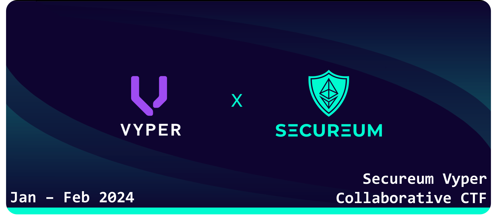

# Secureum Vyper CTF Week 1: Challenge design



If you are reading this, congratulations! You have made it to the top 16 of RACE-26 and are officially participating in the Secureum Vyper CTF!

## What is this about?

The: Secureum Vyper CTF is a collaborative competition where you will design and submit an original CTF challenge written in Vyper and deployed on the Holesky testnet.

## Week 1: Challenge design

In this first week, you will be designing and submitting a CTF challenge completely written in Vyper and deployed on the Holesky testnet (use the following RPC endpoint: `https://ethereum-holesky.publicnode.com/`).

### Frameworks

To do so, you can use any framework or tool you want, such as:

- [Foundry](https://book.getfoundry.sh/), through [pcaversaccio](https://github.com/pcaversaccio)'s [`VyperDeployer.sol`](https://github.com/pcaversaccio/snekmate/blob/main/lib/utils/VyperDeployer.sol)
- [Brownie](https://eth-brownie.readthedocs.io/en/stable/)
- [ApeWorkX](https://docs.apeworx.io/), through the [`ape-vyper`](https://github.com/ApeWorX/ape-vyper) plugin
- [Hardhat](https://hardhat.org/docs), through the [`hardhat-vyper`](https://hardhat.org/hardhat-runner/plugins/nomiclabs-hardhat-vyper) plugin
- [Remix IDE](https://remix.ethereum.org/), through the `vyper-plugin` (see [the plugins list](https://remix-ide.readthedocs.io/en/latest/plugin_list.html))

### `vyper` compiler

If it's your first time working with Vyper, or generally any kind of `python`-based project, you might want to install the `vyper` compiler and its dependencies in a virtual environment. To do so, you can follow the instructions in the [Vyper documentation](https://docs.vyperlang.org/en/latest/installing-vyper.html#creating-a-virtual-environment).

### Submission

To submit your challenge, you will need to create a private repository in your GitHub account and invite [luksgrin](https://github.com/luksgrin) as collaborator. The repository should contain:

- A `README.md` file with a description of the challenge (title, story...), the solution, and the contract's address on the Holesky testnet (there's no need to verify the source code, but feel free to do so if you want to)
- The source code of your challenge in a `src/` directory

It is recommended that you use a framework that allows you to write tests for your challenge, but it is not mandatory. If you do write tests, you can include them in a `test/` directory.

For the sake of consistency, all challenges must implement the `IVyperSecureumCTF` interface, which is defined as follows:

```python
@external
def isSolved() -> bool:
    """
    Returns whether the challenge has been solved or not.
    """
    pass
```

### Evaluation

The challenge will be considered valid if it is solvable by (at least) the solution you provide. If deemed solvable, the challenge will be added to the roster of challenges for the second week of the competition.

## Week 2: Challenge solving

In this second week, you will be submitting solutions and write-ups of your peers' Vyper CTF challenges, and will accumulate points by doing so. To solve a challenge, you will have first to fork the network (remember, use this RPC endpoint: `https://ethereum-holesky.publicnode.com/`) on block `WILL_UPDATE_WITH_BLOCK` to verify your solution.

## Scoring

The scoring system is as follows:

- 1 point for submitting a valid solution, i.e. a smart contract that solves the challenge and makes `isSolved()` return `True`
- 3 points for submitting a valid solution **that differs** from the one provided by the challenge's author (which would imply that the challenge had multiple solutions)

### Prizes

- The top 3 leaderboard at the end of the competition will receive a commemorative POAP
- The best write-up of the competition will receive a commemorative POAP _(the more challenges you solve, the more chances you have to win!)_
- The prize pot of the competition will be 200 Holesky ETH shared proportionally among participants depending on the number of points obtained

## Post-competition

After the competition, the challenges, writeups and solutions will be made public for everyone to enjoy and learn from. All participants will be given credit for their challenges and writeups.

## Example

To give you an idea of a valid submission, head over to the [`example`](example) directory.

